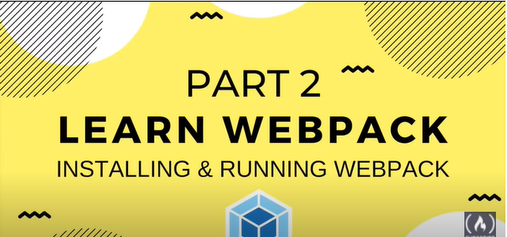

# WebPack_pill
## Main Objectives
+	Understand what WebPack is and know its basics
+	To be able to deploy a web project that uses webpack to generate its assets
+	Understand what Javascript modules are and how to use them
+	Understand how a project is configured for different execution environments
+	Install and configure WebPack Plugins
+	Understand what ECMAScript 6 is and be able to use its new features thanks to WebPack
+	Optimize images automatically by applying various rules.


## Module-a.js

A file called module-a.js that contains a javascript module that makes use of the new features of ECMAScript 6 such as:
+	Make use of the arrow function
+	Make use of the new ECMAScript 6 class structure
+	Make use of the Template Strings
+	Make use of Let and Const

## Module-b.js
+	A file called module-b.js that contains a javascript module that makes use of the JQuery library (JQuery must be imported via webpack not manually)

## Main.js
+ A main.js file that will be your main Javascript file responsible for calling the modules that your application needs (at least the module-a and module-b)


## CSS
+	A sass file called colors.scss that applies the css style rules related to colors.
+	A sass file called text.scss that applies the css style rules related to text.
+	A sass file called main.scss (which will be responsible for importing the colors.scss and text.scss files)

## Images

+	Create an image file with a .png extension weighing less than 8kb
+	Create an image file with extension .svg with a weight less than 8kb
+	Create an image file with a .png extension with a weight greater than 12kb
+	Create an image file with extension .jpg with a weight greater than 1MB

## HTML
Create an index.html file that serves as an entry point to the application. It is necessary that this file automatically includes the assets generated. This means that webpack has to be responsible for injecting calls to assets.

---
```
File structure and readme have been inserted in commit #1 and 2#
```
---
<br>

## Installing WebPack
In order to install webpack we made use of the following tutorial part

[](https://www.youtube.com/watch?v=MpGLUVbqoYQ&t=1831s "Installing and Running WebPack")

You can aswell go to the offical website and follow the instructions

## **BASIC SETUP**
First let's create a directory, initialize npm, install webpack locally, and install the webpack-cli (the tool used to run webpack on the command line):

```
mkdir webpack-demo
cd webpack-demo
npm init -y
npm install webpack webpack-cli --save-dev
```


**End of installation**
---
On the commit #3 we will find as the webpack has been installed and gets the code from index.js into main.js compiled on a single line.
In order to keep updating webpack you must execute npm start.


**Implementation of old code with dependencies**
---
Sucessfully implemented old code and called trough index.js. Commit #4 shows an example of how sucessfully was execujet, it is important to do the npm start from the webpack-demo folder.

**Configuring Webpack**
---
On this segment we will change the default configuration, at this moment dist is generated and it runs through index.js without telling it to do it before, let's change that.

On the file **webpack.conf.js** we will put the specifics

If in de cofniguration file, we set it to **development** it will stop minimazing it.

The file you will see the sue of eval in development, it is configured this way:
+ We go to dvlopment tool
+ We insert 
+ ````
   devtool: "none"
+ And we will see as the code on the file main.js remains unchanged
+ __webpack_require__ will make sure eveyrthing works as it should
